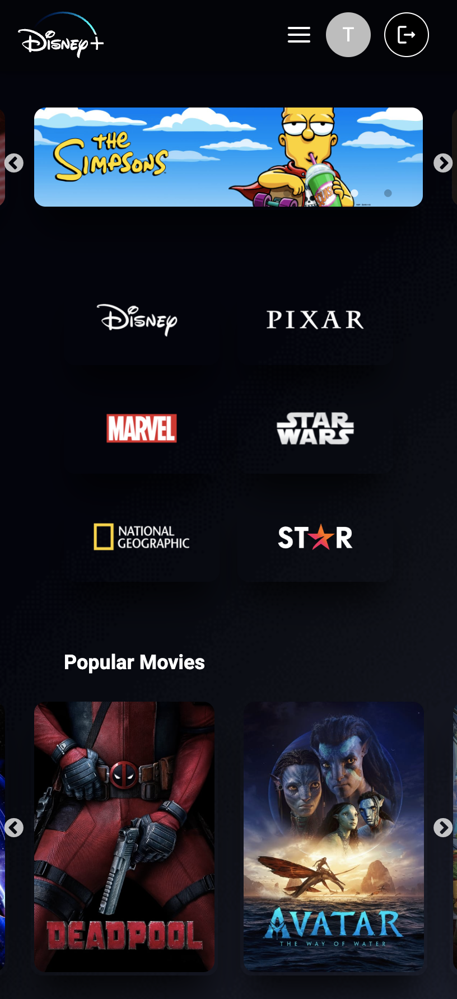
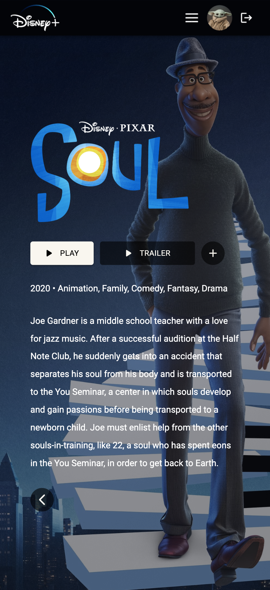
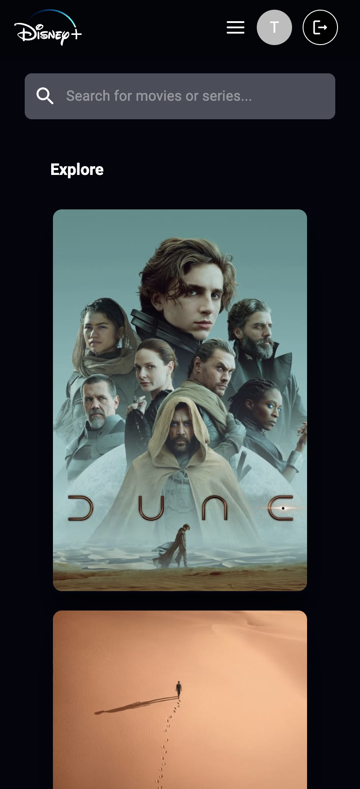
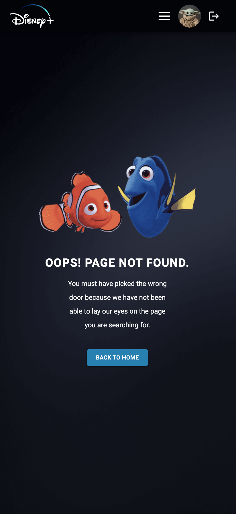

<a name="readme-top"></a>

<div align="center">
    
  <h2 align="center">Disney Plus App Clone</h1>
    <br />
    <a href="https://mkwiecien00.github.io/disney-plus-clone/">View Demo</a>
    ·
    <a href="https://github.com/mkwiecien00/disney-plus-clone">Explore the docs</a>
</div>

<details open="open">
  <summary>Table of Contents</summary>
  <ol>
    <li>
      <a href="#about-the-project">About The Project</a>
      <ul>
        <li><a href="#usage">Usage</a></li>
      </ul>
    </li>
      <li><a href="#sample-credentials">Sample Credentials</a></li>
    <li>
      <a href="#getting-started">Getting Started</a>
      <ul>
        <li><a href="#prerequisites">Prerequisites</a></li>
        <li><a href="#installation">Installation</a></li>
      </ul>
    </li>
    <li><a href="#contact">Contact</a></li>
  </ol>
</details>

<!-- ABOUT THE PROJECT -->

## About The Project

This project is an attempt to clone the Disney+ App. It is so far built with React, Redux Toolkit, React Router, Tanstack Query, Vite, styled components, Material UI, Framer Motion, Firebase, the TMDB API and other third-party libraries such as React Spinners. Moreover, it is fully responsive and follows the mobile-first concept.

<!-- DESKTOP SCREENSHOTS -->


<!-- MOBILE SCREENSHOTS -->

 

 


https://github.com/mkwiecien00/disney-plus-clone/assets/99047592/8781318b-0afc-45b1-a19a-4b7b33fdcc4a


https://github.com/mkwiecien00/disney-plus-clone/assets/99047592/3c2c1136-b330-4fda-86fc-1dc3003b2613


<p align="right">(<a href="#readme-top">back to top</a>)</p>

### Usage

This app was created to develop my skills in programming in React and in using a React-related environment.

For signed-in users, the currently functional links in the app are links to the Disney+ homepage, Movie/Series Details page, Search page, My List page, and the Movies/Series pages.
For those who are not signed in, it is only possible to view the Homepage, but actually without the possibility to go any further.
For such users, in the upper right corner of the Homepage, there is a 'GET STARTED' button, which takes the user to a SignIn/Up Page.
Once signed into the platform, the user has full access to it.

At the moment, the application offers the user, among other things:

- the possibility to display real-time data thanks to the TMDB API,
- the display of details for each resource including the trailer video,
- the search and display of resources that contain a phrase entered by the user,
- the possibility to store resources chosen individually by each user to be viewed,
- and the ability to search for resources of specific genres, e.g. searching only for documentaries.

When visiting other pages, with the navigation, an error page is displayed thanks to React Router, as the pages' url's are not recognisable.
This application has protected routes that can only be accessed by signed-in users. Anytime a non-logged-in person wants to go to a protected page, a login panel is displayed.

Users are logged out after 5 minutes of being inactive.


<p align="right">(<a href="#readme-top">back to top</a>)</p>

<!-- SAMPLE CREDENTIALS -->

## Sample Credentials

**Sample login details, please enter them into the sign-in panel in order to use this app:**

- login: test@test.com
- password: test123

<p align="right">(<a href="#readme-top">back to top</a>)</p>

<!-- GETTING STARTED -->

## Getting Started

### Prerequisites

- Node.js installed on your machine.
- To make this project work while hosting it on GitHub Pages, I hardcoded my own TMDB API key and Firebase Config.

Nevertheless, please note that the good practice is actually to store the credentials as environmental variables and use gitignore on the .env file to hide them in the public repo. It is also important to modify your website's code to access the API keys from the environment variables instead of hardcoding them.

If you want to use your own TMDB API key, you can get it by creating an account on the [TMDB](https://www.themoviedb.org/) website. Please then follow the [documentation](https://developers.themoviedb.org/3/getting-started/introduction) to create the API key.
You might also want to use your own Firebase Config, and for that you will need an account on [Firebase](https://firebase.google.com). Then, you should create a project on your Firebase account dedicated to this Disney+ project.

Since we're using GitHub Pages, it is worth remembering that it provides hosting only for static sites. In other words, a GitHub Pages site hosts only HTML and JavaScript and doesn't provide any server-side support. Everything we publish there is available to clients.
Therefore, in order to ensure the security of credentials and provide them for GitHub Pages so that GitHub Pages would be able to use them, we would need some sort of backend server to hold them.

### Installation

1. Clone the repository:

   ```
   git clone https://github.com/mkwiecien00/disney-plus-clone.git
   ```

2. Navigate to the project directory:

   ```
   cd disney-plus-clone
   ```

3. Install the dependencies:

   ```
   npm install
   ```

4. Start the development server:

   ```
   npm run dev
   ```

5. Open your browser and visit http://localhost:5173 to view the application.

<p align="right">(<a href="#readme-top">back to top</a>)</p>

<!-- CONTACT -->

## Contact

LinkedIn - [Małgorzata Kwiecień](https://www.linkedin.com/in/malgorzatakwiecien00/)

<p align="right">(<a href="#readme-top">back to top</a>)</p>
