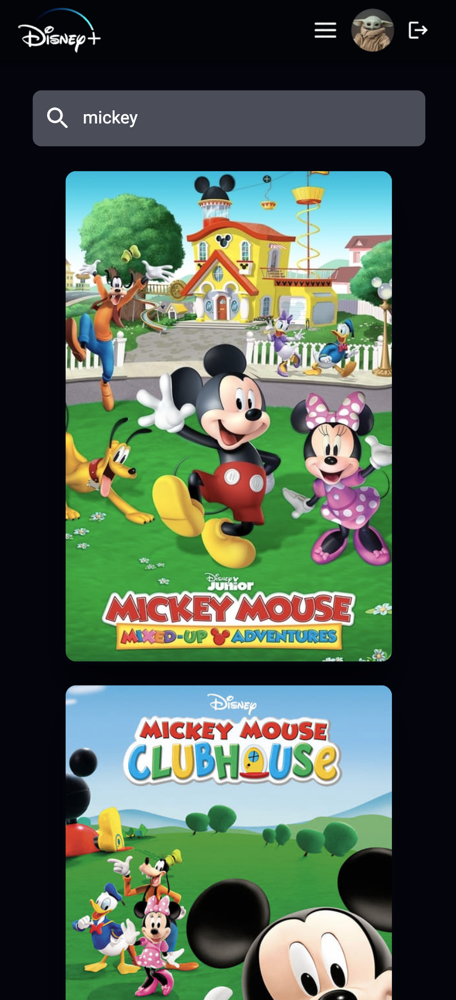

<a name="readme-top"></a>

<div align="center">
    
  <h2 align="center">Disney Plus App Clone</h1>
</div>

<details>
  <summary>Table of Contents</summary>
  <ol>
    <li>
      <a href="#about-the-project">About The Project</a>
      <ul>
        <li><a href="#usage">Usage</a></li>
      </ul>
    </li>
    <li>
      <a href="#getting-started">Getting Started</a>
      <ul>
        <li><a href="#prerequisites">Prerequisites</a></li>
        <li><a href="#installation">Installation</a></li>
      </ul>
    </li>
    <li><a href="#contact">Contact</a></li>
  </ol>
</details>

<!-- ABOUT THE PROJECT -->

## About The Project

This project is an attempt to clone the Disney+ App. It is so far built with React, React Router, Tanstack Query, Vite, styled components, Material UI, Framer Motion, the TMDB API and other third-party libraries such as React Spinners. Moreover, it is fully responsive and follows the mobile-first concept. Please note, that this project is still under development, so any updates will appear gradually.

<!-- DESKTOP SCREENSHOTS -->


<!-- MOBILE SCREENSHOTS -->

 

 


https://github.com/mkwiecien00/disney-plus-clone/assets/99047592/d0abd1d3-9676-4a17-a0a9-3c63bfefc365


https://github.com/mkwiecien00/disney-plus-clone/assets/99047592/4836f9be-5af4-41ef-8253-a978c9f7be57


<p align="right">(<a href="#readme-top">back to top</a>)</p>

### Usage

This app was created to develop my skills in programming in React and in using a React-related environment.

Currently functional links in the app are links to the Disney+ homepage, Movie/Series Details page, Search page, and the Movies/Series pages.
At the moment, the application offers the user, among other things, the possibility to display real-time data thanks to the TMDB API, the display of details for each resource including the trailer video, the search and display of resources that contain a phrase entered by the user, and the ability to search for resources of specific genres, e.g. searching only for documentaries.
When visiting other pages, with the navigation, an error page is displayed thanks to React Router, as the pages' url's are not recognisable.

The project is still under development. The functionalities that will be implemented include:

- a My List page, which will store resources chosen by the user to be viewed, with the help of Redux Toolkit
- user authentication (+login panel and the possibility of logging the user out)
- testing

<p align="right">(<a href="#readme-top">back to top</a>)</p>

<!-- GETTING STARTED -->

## Getting Started

### Prerequisites

- Node.js installed on your machine.
- To make this project work while hosting it on GitHub Pages, I hardcoded my own TMDB API key.

Nevertheless, please note that the good practice is actually to store the auth token in an environmental variable and use gitignore on the .env file to hide the auth token in the public repo. It is also important to modify your website's code to access the API key from the environment variable instead of hardcoding it.
If you want to use your own TMDB API key, you can get it by creating an account on the [TMDB](https://www.themoviedb.org/) website. Please then follow the [documentation](https://developers.themoviedb.org/3/getting-started/introduction) to create the API key.

Since we're using GitHub Pages, it is worth remembering that it provides hosting only for static sites. In other words, a GitHub Pages site hosts only HTML and JavaScript and doesn't provide any server-side support. Everything we publish there is available to clients.
Therefore, in order to ensure the security of API key and provide it for GitHub Pages so that it would be able to use it, we would need some sort of backend server to hold them.

### Installation

1. Clone the repository:

   ```
   git clone https://github.com/mkwiecien00/disney-plus-clone.git
   ```

2. Navigate to the project directory:

   ```
   cd disney-plus-clone
   ```

3. Install the dependencies:

   ```
   npm install
   ```

4. Start the development server:

   ```
   npm run dev
   ```

5. Open your browser and visit http://localhost:5173 to view the application.

<p align="right">(<a href="#readme-top">back to top</a>)</p>

<!-- CONTACT -->

## Contact

LinkedIn - [Małgorzata Kwiecień](https://www.linkedin.com/in/malgorzatakwiecien00/)

Solution URL: [GitHub](https://github.com/mkwiecien00/disney-plus-clone)

Live Site URL: [GitHub Pages](https://mkwiecien00.github.io/disney-plus-clone/)

<p align="right">(<a href="#readme-top">back to top</a>)</p>
